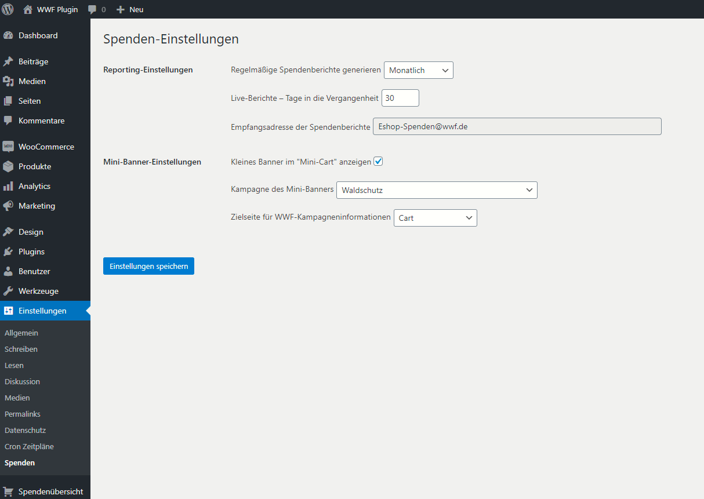
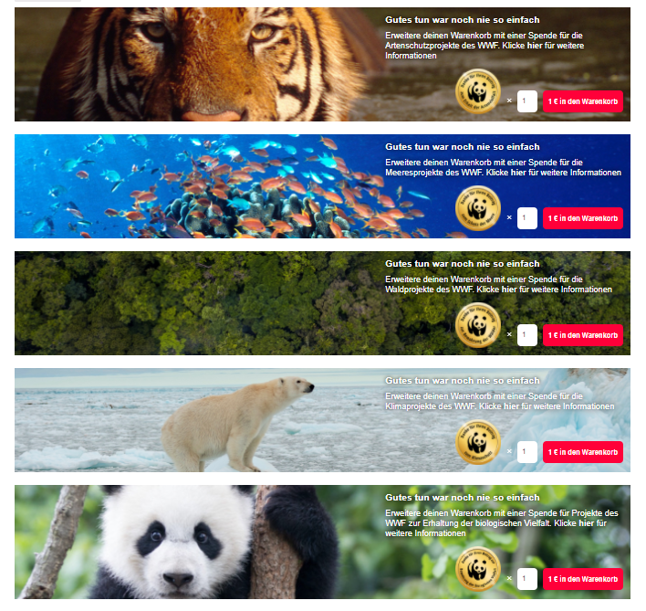
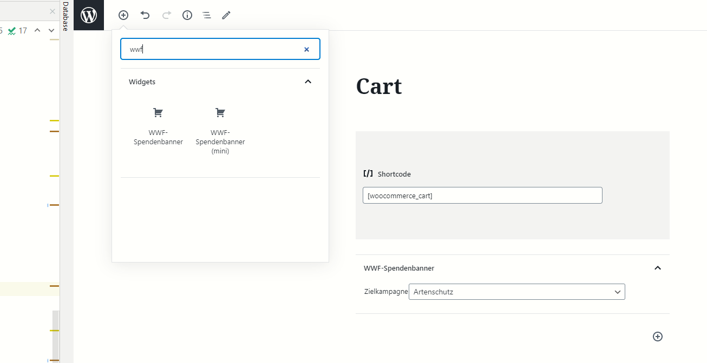

# WWF Donations Plugin

**Plugin for WordPress to collect donations in a WooCommerce shop for the non-profit
organization [WWF](https://www.wwf.de/). Automatically sending mail reports.**

**NOTE:** Currently this plugin is in German language available only.

Do you have questions, want to request a feature or do you found a
bug? [-> Create issues!](https://github.com/EXXETA/wordpress-plugin-donations/issues)

For a full feature list visit the main project's README.

## Server and WordPress requirements

- PHP 7.3+
- MySQL/MariaDB 5.7+/10.3+
- Required active WordPress plugins:
    - `woocommerce`
- WordPress crons (= scheduled events) are set up and are running at least once a day.
- **Important:** WordPress should be able to send mails via `wp_mail`. If you are not sure about this, e.g.
  check [this article](https://wphelp.de/wordpress-email) and test successful mail delivery.
- WooCommerce is (initially) set up
    - Currency: Euro

# Setup - Installation procedure

1. Be sure to meet the listed requirements for the web server and the WordPress installation, *before* you proceed.
2. Extract provided archive of this plugin to `wp-content/plugins` directory.
3. Install and activate this plugin in WordPress plugin management section.
4. Configure plugin settings in `Einstellungen > Spenden`.
5. Add the banner to your *WooCommerce* cart page by using a block (in "Gutenberg" editor)
   or as an alternative you can use a WordPress shortcode (documented below). Technically both ways lead to the same
   markup/result.
6. Read this documentation carefully to understand how this plugin is supposed to work.
7. You'll get regular donation reports and you *must* transfer the donated money to
   the [WWF Germany](https://www.wwf.de/). More information (including bank account) is given in the plugin's dashboard.

**NOTE:** After the first plugin installation there will be generated a first (probably empty) report.

# Plugin's functionality

### Campaigns/Products

This plugin will create one new product category in a WooCommerce shop called "Spendemünzen" containing six donation
products (à 1 €) for different campaigns:

- Protecting **species**
- Protecting **oceans**
- Protecting **forests**
- Protecting **climate**
- Protecting **diversity**

*Note:* You can view the WooCommerce product IDs in plugin's report dashboard page.

*Note:* Products are not removed during the uninstallation process. You have to remove them yourself for a complete
cleanup.

#### Default WooCommerce product configuration for donation products

- virtual
- no stock management enabled
- no backorders allowed
- no taxation (`tax_status='none'`)
- not sold individually
- no reviews allowed
- `catalog_visibility='hidden'`
- weight = 0
- regular price = sale price

**NOTE:** You are free to modify the WooCommerce products in your shop once this plugin is installed and activated. This
plugin won't overwrite your custom product configuration.

### Shortcode `wwf_donations_banner`

You can configure the target donation campaign by providing a `campaign` argument. If no campaign is given, the *
default* one is: `protect_species_coin`.

Valid values for `campaign` argument are:

- `protect_species_coin`
- `protect_ocean_coin`
- `protect_forest_coin`
- `protect_climate_coin`
- `protect_diversity_coin`

Example of shortcode usage: `[wwf_donations_banner campaign='protect_climate_coin']`

### Shortcode `wwf_donations_banner_small`

This shortcode works in the same way as `wwf_donations_banner` does, except the *default* campaign is set
to `protect_diversity_coin`. You can use the `campaign` argument, too.

If no campaign is specified explicitly, the default one or the one defined in plugin's settings page will be used.

### Reports

You can configure three different report interval modes: `weekly`, `monthly`, `quarterly`.

Each report will be send by mail to an address you can view, but not change in plugin's backend section.

Technically the report generation is a summation of plugin's donation products in completed or processed orders grouped
by a donation campaign in a certain time range.

All reports are persisted as a private custom post type integrated into the WordPress system.

One time per day, a routine will check if the time to generate a new report has been reached. You can view the date and
time of the last check in plugin's report dashboard.

### Plugin's settings

This plugin enables you to modify certain aspects of the donations campaign integration:

- **Reporting interval:** {weekly, monthly, quarterly}
- **Report preview default days in past:** This can be overwritten in the preview section.
- (readonly) **Recipient's mail address:** You can't change this value and you must not.
- **Show Mini-Banner in Mini-Cart:**\* yes/no flag.
- **Campaign of mini-banner:**\* Default is "protect diversity"
- **Target page of "more information" link in Mini-Banner:**\* Default is the WooCommerce "Cart page".

\* If you change these settings, in order to see the effects, you need to clear your browser's cookies and the local
storage one time. E.g. by doing the following:
`Dev Tools -> Application -> Local Storage -> Delete the entry which is prefixed by 'wc_cart_hash...' and reload the page`
.

### (Custom) banner design/styling

This plugin is shipped with self-contained responsive CSS styles without dependencies to a specific theme or framework.
Although the styles should work in most setups there are situations when you want to modify the styles, e.g. if you use
special fonts or a special theme. Feel free to overwrite the styles as you want as long as there are no major
differences in regard to contents and copyright.

Officialy this plugin is developed and tested with the Theme `Shophistic Lite`.

*NOTE*: Styles are included by WordPress only if the banner was placed into a page/post or if the mini-banner
integration is enabled.

- **General tested minimum screen width:** `320px`
- **Maximum screen width:** `4k+`
- Main banner main class: `.cart-donation-banner`
- Small banner main class: `.cart-donation-mini-banner`
- CSS styles: `wwf-donations-plugin/banner.css`
- SCSS styles (for development/modifications): `wwf-donations-plugin/styles/banner.scss`

## Screenshots

# Development

## Requirements for development

- PHP Language Level 7.3+
- MySQL/MariaDB 5.7+/10.3+
- `docker` and `docker-compose`
- Composer for PHP
- WordPress crons (= scheduled events) are activated (simply by calling [wp-cron.php](http://127.0.0.1/wp-cron.php))
- `npm`

# Plugin Development

This repository contains a docker-compose configuration for a reproducible environment during development. The
directory `./wwf-donations-plugin` will be mounted into the WordPress container.

**NOTE:** For an easy setup procedure, simply execute `setup.sh` in this repository and run `docker-compose`-commands
afterwards.

* You need [Composer](https://getcomposer.org) as package manager for PHP and `npm` for JavaScript. Note: You need at
  least the following **PHP extensions** enabled:
    - `openssl`
    - `dom`
    - `json`
    - `libxml`
    - `mbstring`
    - `xml`
    - `xmlwriter`
* cd into `wwf-donations-plugin` directory and execute `composer install` and `npm install`
* Build CSS artifacts via `npm run build` (during development you can also use `npm run stylewatch`)
* Build JS artifacts via `npm run build-js` (during development you can also use `npm run start`)
* Start the whole stack (database + WordPress instance) in containers and find out the container ID of the WordPress
  instance via `docker ps`

### Run shop on your local machine

* This project uses a custom docker WordPress image with predefined plugins, themes etc.
* Build the development container with `docker-compose build`
* Open the directory of this README in cmd and run command `docker-compose up -d --remove-orphans`. Consider
  using `--force-recreate`
  in some cases. The initial setup procedure will take approx. 30 secs.
    * Note that after 10 seconds the WordPress setup routine starts inside the WordPress container, which is defined
      in `wp-entrypoint.sh`.
* Check if container is running `docker container ls` or `docker ps`.
* Open local shop via web browser [http://127.0.0.1](http://127.0.0.1). Append `/wp-admin` to URL for backend access.
* **Be sure** to run the WooCommerce plugin setup wizard once logged in at initial startup. Note that we **do not** use
  the Jetpack Plugin yet.

### WordPress development setup information

* Locale: `de_DE`
* Backend user: `admin:password`
* Site URL: [`http://127.0.0.1`](http://127.0.0.1)
* Backend URL: [`http://127.0.0.1/wp-admin`](http://127.0.0.1/wp-admin)
* Required plugins
    * Woocommerce
* Default theme
    * Shophistic Lite
* Currency: Euro

### Further information

* To get a shell inside the WordPress development container, simply use: `docker exec -ti <container_id> bash`. Your
  working directory inside the container is `/var/www/html`.
* You can use the `wp` command as documented [here](https://wp-cli.org), e.g. to enable/disable the current plugin
  type `wp plugin toggle wwf-donations-plugin`
* To run **unit tests**, cd into `wwf-donations-plugin` and execute `./vendor/phpunit/phpunit/phpunit test`
* For tests with a lot of orders, use [this plugin](https://github.com/75nineteen/order-simulator-woocommerce).
* Simple performance measurement: 1000 orders in a report time range need ~25 seconds during report generation

### Shutdown and cleanup

**Warning:** This will remove the complete database and all existing data!

* Open this directory in cmd and run command `docker-compose down --volumes`.

### Update WordPress container

- Stop all running containers via `docker-compose down --volumes`
- `docker-compose pull`
- `docker-compose build`
- Start with `docker-compose up`

## TODO

- Multi-Language Support/I18N
- Add copyright header to source files
- Test with other themes
- Test without WooCommerce

## Links

* [Detailed Plugin Guidelines](https://developer.wordpress.org/plugins/wordpress-org/detailed-plugin-guidelines/)
* [Quickstart: Compose and WordPress](https://docs.docker.com/compose/wordpress)
* [WP CLI](https://wp-cli.org)
* [Wordpress JS build setup for Gutenberg Blocks](https://developer.wordpress.org/block-editor/tutorials/javascript/js-build-setup/)

# License & Copyright

All images in `wwf-donations-plugin/images/` are explicitly excluded of the licensing policy mentioned below.

This plugin is licensed under [GPL v3.0](./LICENSE).